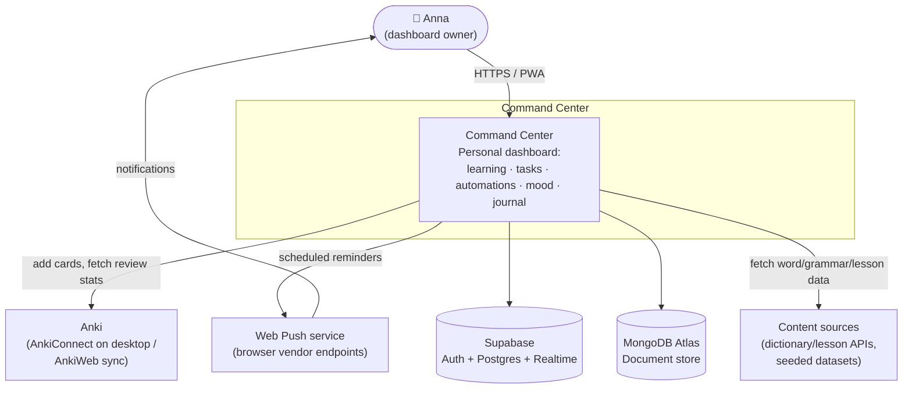
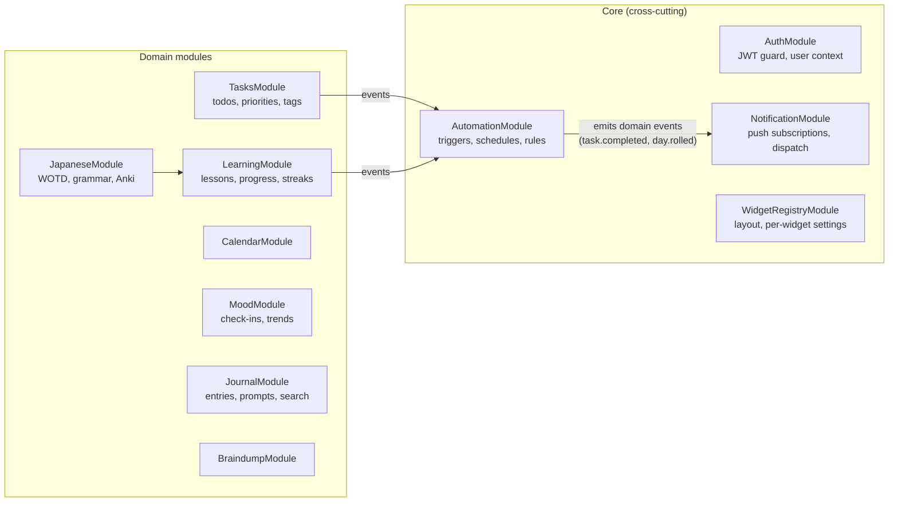
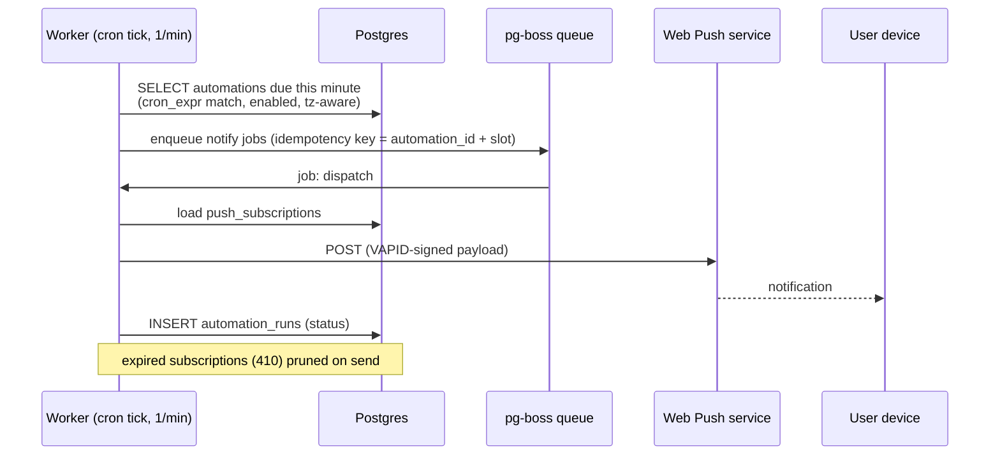

# Command Center — Architecture Reference Document (ARD)

| | |
|---|---|
| **Status** | Draft v0.1 |
| **Date** | 2026-07-11 |
| **Scope** | Full system: frontend, backend services, data, automation, integrations |
| **Audience** | Project owner + future contributors (human or AI) |

---

## 1. Introduction

### 1.1 Purpose

Command Center is a personal dashboard: a single place to track learning (Japanese + tech micro-lessons), manage tasks, run daily automations/reminders, track mood, and journal. This document records the target architecture, the reasoning behind it, and the non-functional requirements it must satisfy.

### 1.2 Goals

- **G1 — One cohesive surface.** All widgets live in one customizable dashboard; adding a new life-area never requires touching another widget.
- **G2 — Low operational burden.** This is a personal project; it must survive weeks of neglect. Managed services over self-hosted, boring tech over novel.
- **G3 — Learning vehicle.** The stack (Next.js, NestJS, Supabase, MongoDB) is deliberately chosen to build skills; some redundancy (two databases) is accepted for that reason and contained by design.
- **G4 — Extensible widget contract.** Future widgets (habits, Pomodoro, fitness, finance, Home Assistant) plug in without core changes.

### 1.3 Non-Goals (v1)

- Multi-tenant SaaS. Built single-user first, but auth and data models are user-scoped from day one so multi-user is a config change, not a rewrite.
- Native mobile apps. Responsive web + PWA (installable, push notifications) covers mobile.
- Offline-first sync. Optimistic UI yes; full CRDT-style offline sync no.
- Real-time collaboration.

---

## 2. System Context (C4 Level 1)



**External dependencies and their failure posture:**

| Dependency | Used for | If unavailable |
|---|---|---|
| Supabase | Auth, relational data, realtime | App unusable (accepted single point of failure) |
| MongoDB Atlas | Documents (journal, braindump, content) | Affected widgets show error state; rest of dashboard works |
| Anki (AnkiConnect) | Deck sync, review stats | Widget degrades to "last synced" data; "Add to Anki" queues locally |
| Web Push | Reminders | Automations still logged in-app; notification bell as fallback |
| Content APIs | Word/lesson of the day | Serve from pre-seeded content cache |

---

## 3. High-Level Architecture (C4 Level 2 — Containers)


### 3.1 Container responsibilities

**Next.js app (Vercel)**
- Dashboard shell: widget grid, layout persistence, theming, quick actions.
- Talks to the NestJS API for all domain reads/writes (single API surface, versioned `/api/v1`).
- Talks to Supabase **directly only** for: auth flows (sign-in, session refresh) and realtime subscriptions (e.g., live task updates). Everything else goes through the API — this keeps authorization logic in one place.
- Server Components for initial dashboard render (fast first paint); client components + TanStack Query for widget interactivity.

**NestJS API (modular monolith)**
- One deployable, strict module boundaries (see §4). "Modular backend services" from the README is realized as *modules inside one process* until scale or isolation demands extraction — see ADR-002.
- Validates Supabase-issued JWTs; owns all authorization decisions.
- OpenAPI spec generated from decorators; the frontend consumes a generated typed client.

**NestJS Worker**
- Same repo/codebase, separate entrypoint and process. Runs cron evaluation for automations, consumes queued jobs (push dispatch, Anki sync, streak rollover, content prefetch).
- Kept separate from the API process so a stuck job never blocks interactive requests.

### 3.2 Repository & code organization

Monorepo (pnpm workspaces + Turborepo) — see ADR-001:

```
command-center/
├── apps/
│   ├── web/            # Next.js
│   └── api/            # NestJS (API + worker entrypoints)
├── packages/
│   ├── contracts/      # zod schemas + generated API client types (shared FE/BE)
│   ├── ui/             # shared UI primitives + widget SDK
│   └── config/         # eslint, tsconfig, prettier presets
└── docs/               # this ARD, ADRs, runbooks
```

---

## 4. Mid-Level Design

### 4.1 Backend module decomposition (NestJS)



**Module rules (enforced via ESLint boundaries):**
- Domain modules never import each other directly; cross-domain reactions go through an in-process event bus (`@nestjs/event-emitter`). Example: `TasksModule` emits `task.completed`; `AutomationModule` listens and evaluates "after finishing a task" smart reminders.
- Each module owns its persistence — no shared repositories across modules. This is what makes later extraction to a real service cheap (ADR-002).
- Every module exposes: REST controller(s), a service layer, and optionally event handlers. Controllers are thin; rules live in services.

### 4.2 Frontend widget system

The widget contract is the core extensibility mechanism (G4):

```typescript
// packages/ui — widget SDK (illustrative)
interface WidgetDefinition<TSettings = unknown> {
  id: string;                        // "japanese-word", "todo", "mood"
  title: string;
  sizes: WidgetSize[];               // grid footprints it supports
  component: React.ComponentType<WidgetProps<TSettings>>;
  settingsSchema: z.ZodType<TSettings>;  // drives the auto-generated settings panel
  quickActions?: QuickAction[];      // rendered in the widget chrome
}
```

- **Registry pattern:** widgets self-register into a client-side registry; the dashboard shell renders from the user's persisted layout (widget id + position + size + settings). Adding a widget = adding one folder under `apps/web/widgets/` + one registry entry.
- **Isolation:** each widget gets an error boundary and its own suspense boundary — a broken widget renders a fallback card, never a blank dashboard.
- **Data:** widgets fetch through hooks in `packages/contracts` (generated from OpenAPI). No widget talks to Supabase/Mongo directly.
- **Layout persistence:** grid layout stored per-user via `WidgetRegistryModule` (Postgres, JSONB column for settings).

### 4.3 Data architecture — who owns what

Two databases is a deliberate (learning-driven) choice — the split is by data shape, and each collection/table has exactly one owner module:

| Store | Data | Why here |
|---|---|---|
| **Supabase Postgres** | users/profiles, tasks, calendar events, mood check-ins, streaks & progress counters, automations/triggers, push subscriptions, widget layouts, appreciation entries | Relational, queried with filters/aggregations (trends, streaks), benefits from RLS, realtime |
| **MongoDB Atlas** | journal entries (rich text as structured JSON), braindump notes, learning content (lessons, word/grammar of the day items), Anki sync snapshots | Document-shaped, schema-flexible content, full-text search (Atlas Search) for journal |

**Rules:**
- No cross-database joins. If a widget needs both (e.g., journal entry linked to a mood check-in), the API composes; references are stored as opaque IDs.
- Mongo is **never** exposed to the client; access only via the API.
- If dual-DB operational cost outweighs learning value, the fallback is folding Mongo collections into Postgres JSONB — the one-owner-per-collection rule keeps that migration scoped (ADR-003).

### 4.4 Core data model (Postgres)


MongoDB collections (owner module in parens): `journal_entries` (Journal), `braindump_notes` (Braindump), `lesson_content` (Learning), `jp_content` (Japanese), `anki_snapshots` (Japanese). All documents carry `userId` and are filtered on it in every query via a repository base class.

### 4.5 Key flows

**Dashboard load:**

```mermaid
sequenceDiagram
    participant B as Browser
    participant W as Next.js (RSC)
    participant A as NestJS API
    participant P as Postgres
    B->>W: GET /
    W->>A: GET /api/v1/layout (JWT from session)
    A->>P: fetch widget_layouts
    W-->>B: shell + skeleton widgets (streamed)
    par per-widget, client-side
        B->>A: GET /api/v1/tasks?due=today
        B->>A: GET /api/v1/japanese/wotd
        B->>A: GET /api/v1/mood/today
    end
    Note over B: each widget hydrates independently;<br/>one failing endpoint = one fallback card
```

**Automation fires (time-based reminder):**



**Smart reminder ("after finishing a task"):** `TasksModule` marks task complete → emits `task.completed` → `AutomationModule` matches event-kind automations → enqueues notify job. Same tail as above.

**Anki integration (constraint worth knowing):** AnkiConnect is a plugin on the *desktop* Anki app — a cloud backend can't reach it. Design: the browser talks to AnkiConnect on `localhost:8765` directly when on the desktop (CORS-permitted from the app origin); "Add to Anki" actions are queued in the API when Anki is unreachable and flushed by the client when it next detects AnkiConnect. Review stats are pushed from client → API and cached in `anki_snapshots`.

---

## 5. Security

### 5.1 Identity & access

- **AuthN:** Supabase Auth (email + TOTP 2FA; OAuth optional later). Frontend holds the session via `@supabase/ssr` cookies (httpOnly). Every API call carries the Supabase JWT.
- **AuthZ in the API:** NestJS global guard verifies the JWT against Supabase's JWKS (asymmetric, no shared secret in the API), extracts `user_id`, and injects it into request context. **Every repository query is user-scoped** — `user_id` comes from the token, never from the request body.
- **Postgres RLS:** enabled on all tables with `user_id = auth.uid()` policies. The API connects with a role that respects RLS (not `service_role`) wherever practical, so RLS is a second net under application checks — and the only net for the client's direct realtime subscriptions.
- **Mongo:** no client access, dedicated DB user scoped to this app's database only, `userId` filter enforced in the repository base class.
- **Single-user posture:** even though v1 has one user, nothing assumes it — no "default user" fallbacks, no unauthenticated endpoints besides `/health`.

### 5.2 Application security

| Surface | Control |
|---|---|
| Input | zod validation at the contract layer (shared schemas) + NestJS ValidationPipe; reject-unknown-fields on |
| Journal rich text | store as structured JSON (e.g., TipTap doc), render through the editor's renderer — never `dangerouslySetInnerHTML`; sanitize on ingest as defense in depth |
| CORS | API allows only the Vercel app origin(s); AnkiConnect CORS scoped to app origin |
| Rate limiting | `@nestjs/throttler` per-user; stricter on auth-adjacent routes |
| Headers | CSP (no inline script; nonce-based), HSTS, frame-ancestors none — via Next.js middleware |
| Secrets | platform env vars (Vercel/Railway/Supabase dashboards); nothing in the repo; `.env.example` documents shape |
| Dependencies | Renovate + `pnpm audit` in CI; lockfile committed |
| Push payloads | encrypted per Web Push spec (VAPID); no sensitive content in notification bodies (titles like "Mood check-in time", not journal text) |

### 5.3 Threat notes (STRIDE-lite, personal-app calibrated)

- **Highest-value asset:** journal + mood data — private reflections. Mitigations: 2FA, RLS, no third-party analytics on journal routes, Mongo network-restricted to backend host IPs/VPC peering where the tier allows.
- **Tampering with automations:** automations execute only `notify` actions in v1 — no arbitrary webhooks/code — so a compromised automation record can annoy, not exfiltrate. Revisit before adding webhook actions or Home Assistant control.
- **Token theft:** short-lived access tokens (1 h), refresh rotation via Supabase; sessions revocable from the Supabase dashboard.
- **Backups as attack surface:** Atlas/Supabase managed backups inherit provider encryption at rest; no manual dump-to-laptop workflow.

---

## 6. Non-Functional Requirements

Targets calibrated for a personal, single-user system — meaningful but not enterprise theater.

| # | Category | Requirement | Target |
|---|---|---|---|
| NFR-1 | Performance | Dashboard first contentful paint (warm) | < 1.5 s p75 |
| NFR-2 | Performance | API reads | < 200 ms p95 per endpoint |
| NFR-3 | Reliability | Automation delivery | fired within 60 s of schedule; at-least-once with idempotent dedupe (no double-notify per slot) |
| NFR-4 | Availability | Core dashboard | ~99 % monthly (managed-tier reality); a failed widget never takes down the shell |
| NFR-5 | Durability | Journal/mood data loss | RPO ≤ 24 h (provider daily backups), RTO ≤ 1 day; quarterly restore test of both DBs |
| NFR-6 | Security | All traffic TLS; RLS on every Postgres table; 2FA on owner account and all provider dashboards | continuous |
| NFR-7 | Privacy | No third-party analytics/trackers; data exportable (JSON dump endpoint per module) | v1 |
| NFR-8 | Cost | Total monthly infra | ≤ €20/mo (free/hobby tiers: Vercel Hobby, Supabase Free, Atlas M0, small backend instance) |
| NFR-9 | Maintainability | Fresh clone → running local stack | ≤ 15 min (`pnpm i && pnpm dev` + documented env setup); CI: typecheck, lint, test, build < 10 min |
| NFR-10 | Observability | Structured JSON logs; Sentry (FE+BE); `/health` per process; uptime ping (e.g., UptimeRobot) on API + worker heartbeat row | v1 |
| NFR-11 | Accessibility | Dashboard + widgets keyboard-navigable; WCAG 2.1 AA color contrast; respects `prefers-reduced-motion` | v1 |
| NFR-12 | i18n | UI copy externalized day one (EN first; FI/JA possible later); Japanese content rendered with proper furigana support | v1 structure, later content |
| NFR-13 | Portability | No hard Vercel/Railway lock-in: Next.js standalone build + API Dockerfile both runnable anywhere | continuous |

---

## 7. Architecture Decision Records

Full ADRs live in `docs/adr/`; summaries here.

| ADR | Decision | Rationale | Alternatives rejected |
|---|---|---|---|
| **001** | Monorepo (pnpm + Turborepo) | Shared contracts package gives end-to-end type safety FE↔BE; one PR spans both; single CI | Two repos (contract drift, double setup) |
| **002** | NestJS **modular monolith** now; extraction path later | One deploy target fits G2 (low ops) and NFR-8 (cost); module boundary + event-bus rules keep extraction cheap if a module ever needs isolation | Microservices day one (ops burden with zero scale need) |
| **003** | Dual DB with strict ownership split (§4.3) | Honors stack goals (G3); shape-based split is defensible; one-owner rule + no cross-DB joins contains the blast radius | Postgres-only with JSONB (simpler — kept as documented fallback); Mongo-only (loses RLS/realtime/auth) |
| **004** | All domain traffic through NestJS API; Supabase client used directly only for auth + realtime | Single authorization point; avoids duplicated ACL logic in RLS *and* API for writes | Full "Supabase as backend" (would gut the NestJS learning goal and scatter logic into edge functions) |
| **005** | Jobs/scheduling via **pg-boss** on the existing Supabase Postgres + a worker process | Zero extra infrastructure (no Redis); transactional enqueue with domain writes; fits NFR-8 | BullMQ + Redis (more standard but +1 service to run/pay for); Supabase cron + edge functions (splits automation logic out of NestJS) |
| **006** | Hosting: Vercel (web) + Railway *or* Fly.io (api + worker) + managed data tiers | Matches README (Vercel); NestJS long-running processes don't fit Vercel functions — worker needs a real process | Everything on Vercel (no persistent worker); a VPS (ops burden) |
| **007** | REST + OpenAPI-generated typed client (not GraphQL/tRPC) | NestJS-native, learning-relevant, tooling-mature; contracts package closes the type gap that would otherwise argue for tRPC | tRPC (couples FE to Nest internals, weaker fit with NestJS idioms); GraphQL (overkill for one consumer) |

---

## 8. Risks & Open Questions

| # | Risk / question | Impact | Mitigation / decision needed |
|---|---|---|---|
| R1 | Dual-DB is 2× the migrations, backups, client libs | Slower iteration | Fallback documented in ADR-003; re-evaluate after first 3 widgets ship |
| R2 | Anki desktop-only reachability | Sync gaps on mobile | Queue-and-flush design (§4.5); consider AnkiWeb scraping *never* (ToS) — accept the constraint |
| R3 | Free-tier limits (Supabase pauses inactive projects; Atlas M0 caps) | Surprise downtime | Uptime ping doubles as keep-alive; document tier limits in runbook |
| R4 | Web Push on iOS requires installed PWA | Missed reminders on iPhone | Document install step; in-app notification center as fallback |
| R5 | Content sourcing for WOTD/lessons (licensing, quality) | Learning widgets are the heart of the product | Start with seeded open datasets (JMdict is licensed CC BY-SA — attribute properly); decide per-source before ingesting |
| Q1 | Timezone handling for automations (travel, DST) | Wrong-time reminders | Store user tz + cron in user-local time; worker evaluates tz-aware. Confirm: single home tz or per-automation tz? |
| Q2 | Journal editor choice (TipTap vs Plate vs Lexical) | Rich-text data format is sticky | Decide before Journal widget; format = editor's JSON doc model |

---

## 9. Delivery Phasing

1. **Phase 0 — Skeleton:** monorepo scaffold, CI, auth end-to-end, empty dashboard shell with widget registry, one trivial widget (clock). *Proves the whole pipe.*
2. **Phase 1 — Daily core:** Tasks, Braindump, Mood check-in + trends. First Postgres + first Mongo widget → validates ADR-003 early.
3. **Phase 2 — Automations:** trigger engine, worker, web push, notification center. *Highest architectural risk — do before more widgets.*
4. **Phase 3 — Learning:** Japanese WOTD/grammar, tech "X of the day", streaks, Anki queue-and-flush.
5. **Phase 4 — Reflection & polish:** Journal, Appreciation, Calendar views, layout customization UI, data export.

Each phase ends deployed and used daily — the product owner is also user #1, so dogfooding is the QA strategy.
