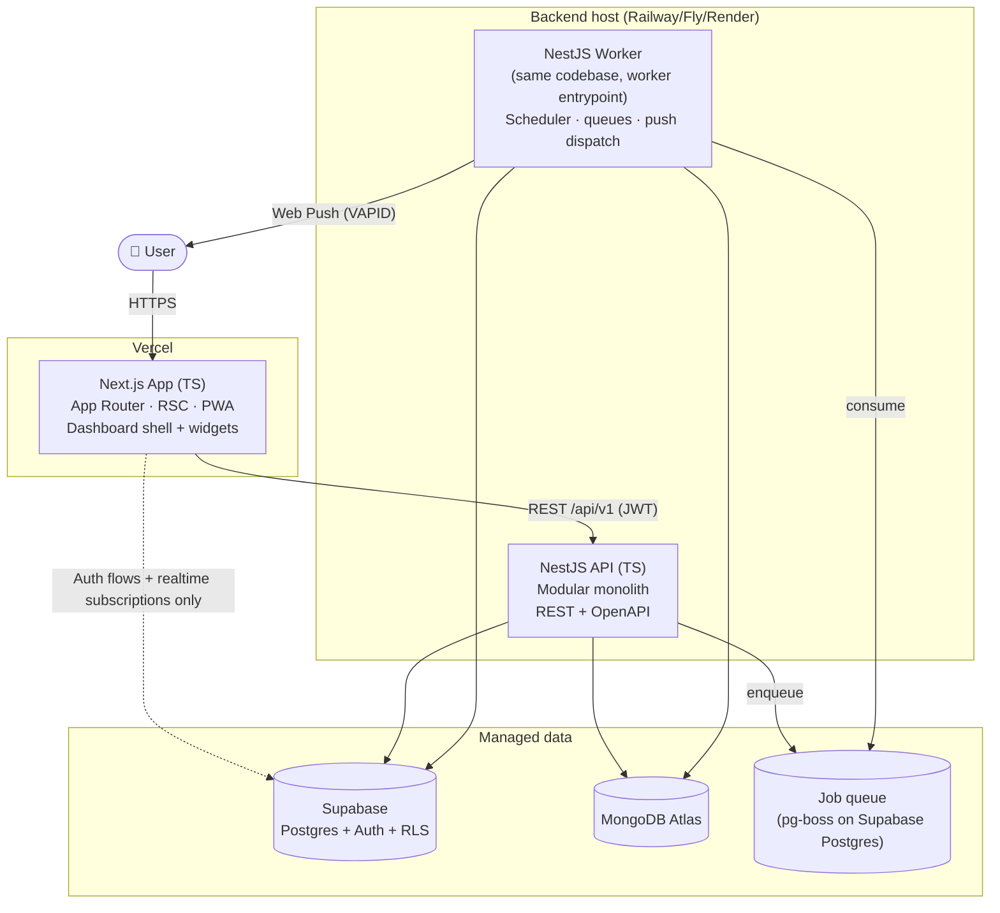
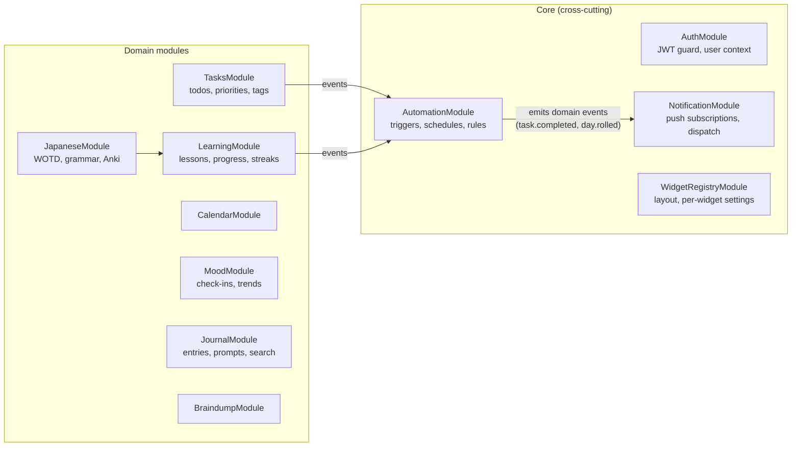
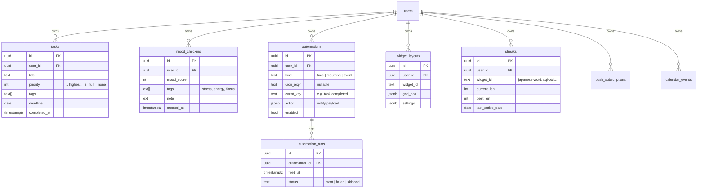
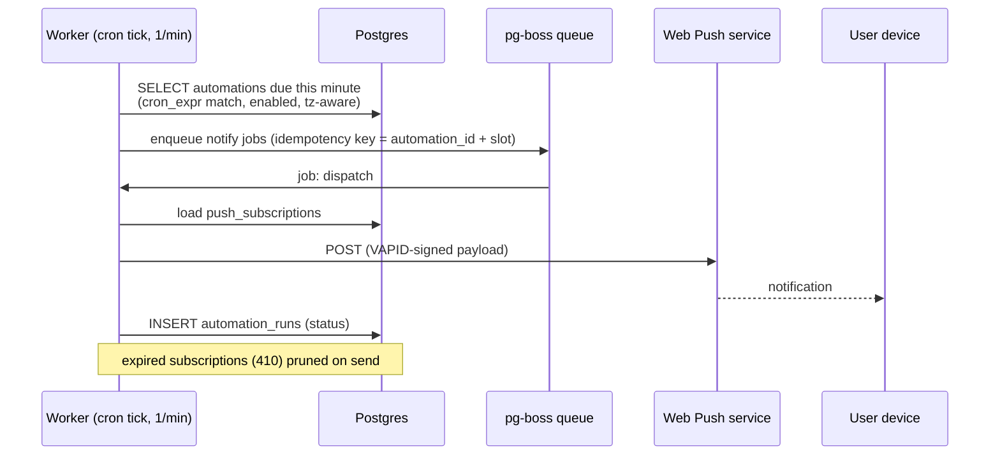

# Command Center — Architecture Reference Document (ARD)

|              |                                                                         |
| ------------ | ----------------------------------------------------------------------- |
| **Status**   | Draft v0.1                                                              |
| **Date**     | 2026-07-11                                                              |
| **Scope**    | Full system: frontend, backend services, data, automation, integrations |
| **Audience** | Project owner + future contributors (human or AI)                       |

---

## 1. Introduction

### 1.1 Purpose

Command Center is a personal dashboard: a single place to track learning (Japanese + tech micro-lessons), manage tasks, run daily automations/reminders, track mood, and journal. This document records the target architecture, the reasoning behind it, and the non-functional requirements it must satisfy.

### 1.2 Goals

- **G1 — One cohesive surface.** All widgets live in one customizable dashboard; adding a new life-area never requires touching another widget.
- **G2 — Low operational burden.** This is a personal project; it must survive weeks of neglect. Managed services over self-hosted, boring tech over novel.
- **G3 — Learning vehicle.** The stack (Next.js, NestJS, Supabase, MongoDB) is deliberately chosen to build skills; some redundancy (two databases) is accepted for that reason and contained by design.
- **G4 — Extensible widget contract.** Future widgets (habits, Pomodoro, fitness, finance, Home Assistant) plug in without core changes.

### 1.3 Non-Goals (v1)

- Multi-tenant SaaS. Built single-user first, but auth and data models are user-scoped from day one so multi-user is a config change, not a rewrite.
- Native mobile apps. Responsive web + PWA (installable, push notifications) covers mobile.
- Offline-first sync. Optimistic UI yes; full CRDT-style offline sync no.
- Real-time collaboration.

---

## 2. System Context (C4 Level 1)


**External dependencies and their failure posture:**

| Dependency         | Used for                                | If unavailable                                                      |
| ------------------ | --------------------------------------- | ------------------------------------------------------------------- |
| Supabase           | Auth, relational data, realtime         | App unusable (accepted single point of failure)                     |
| MongoDB Atlas      | Documents (journal, braindump, content) | Affected widgets show error state; rest of dashboard works          |
| Anki (AnkiConnect) | Deck sync, review stats                 | Widget degrades to "last synced" data; "Add to Anki" queues locally |
| Web Push           | Reminders                               | Automations still logged in-app; notification bell as fallback      |
| Content APIs       | Word/lesson of the day                  | Serve from pre-seeded content cache                                 |

---

## 3. High-Level Architecture (C4 Level 2 — Containers)



### 3.1 Container responsibilities

**Next.js app (Vercel)**

- Dashboard shell: widget grid, layout persistence, theming, quick actions.
- Talks to the NestJS API for all domain reads/writes (single API surface, versioned `/api/v1`).
- Talks to Supabase **directly only** for: auth flows (sign-in, session refresh) and realtime subscriptions (e.g., live task updates). Everything else goes through the API — this keeps authorization logic in one place.
- Server Components for initial dashboard render (fast first paint); client components + TanStack Query for widget interactivity.

**NestJS API (modular monolith)**

- One deployable, strict module boundaries (see §4). "Modular backend services" from the README is realized as _modules inside one process_ until scale or isolation demands extraction — see ADR-002.
- Validates Supabase-issued JWTs; owns all authorization decisions.
- OpenAPI spec generated from decorators; the frontend consumes a generated typed client.

**NestJS Worker**

- Same repo/codebase, separate entrypoint and process. Runs cron evaluation for automations, consumes queued jobs (push dispatch, Anki sync, streak rollover, content prefetch).
- Kept separate from the API process so a stuck job never blocks interactive requests.

### 3.2 Repository & code organization

Monorepo (pnpm workspaces + Turborepo) — see ADR-001:

```
command-center/
├── apps/
│   ├── web/            # Next.js
│   └── api/            # NestJS (API + worker entrypoints)
├── packages/
│   ├── contracts/      # zod schemas + generated API client types (shared FE/BE)
│   ├── ui/             # shared UI primitives + widget SDK
│   └── config/         # eslint, tsconfig, prettier presets
└── docs/               # this ARD, ADRs, runbooks
```

---

## 4. Mid-Level Design

### 4.1 Backend module decomposition (NestJS)



**Module rules (enforced via ESLint boundaries):**

- Domain modules never import each other directly; cross-domain reactions go through an in-process event bus (`@nestjs/event-emitter`). Example: `TasksModule` emits `task.completed`; `AutomationModule` listens and evaluates "after finishing a task" smart reminders.
- Each module owns its persistence — no shared repositories across modules. This is what makes later extraction to a real service cheap (ADR-002).
- Every module exposes: REST controller(s), a service layer, and optionally event handlers. Controllers are thin; rules live in services.

### 4.2 Frontend widget system

The widget contract is the core extensibility mechanism (G4):

```typescript
// packages/ui — widget SDK (illustrative)
interface WidgetDefinition<TSettings = unknown> {
  id: string; // "japanese-word", "todo", "mood"
  title: string;
  sizes: WidgetSize[]; // grid footprints it supports
  component: React.ComponentType<WidgetProps<TSettings>>;
  settingsSchema: z.ZodType<TSettings>; // drives the auto-generated settings panel
  quickActions?: QuickAction[]; // rendered in the widget chrome
}
```

- **Registry pattern:** widgets self-register into a client-side registry; the dashboard shell renders from the user's persisted layout (widget id + position + size + settings). Adding a widget = adding one folder under `apps/web/widgets/` + one registry entry.
- **Isolation:** each widget gets an error boundary and its own suspense boundary — a broken widget renders a fallback card, never a blank dashboard.
- **Data:** widgets fetch through hooks in `packages/contracts` (generated from OpenAPI). No widget talks to Supabase/Mongo directly.
- **Layout persistence:** grid layout stored per-user via `WidgetRegistryModule` (Postgres, JSONB column for settings).

### 4.3 Data architecture — who owns what

Two databases is a deliberate (learning-driven) choice — the split is by data shape, and each collection/table has exactly one owner module:

| Store                 | Data                                                                                                                                                                | Why here                                                                                     |
| --------------------- | ------------------------------------------------------------------------------------------------------------------------------------------------------------------- | -------------------------------------------------------------------------------------------- |
| **Supabase Postgres** | users/profiles, tasks, calendar events, mood check-ins, streaks & progress counters, automations/triggers, push subscriptions, widget layouts, appreciation entries | Relational, queried with filters/aggregations (trends, streaks), benefits from RLS, realtime |
| **MongoDB Atlas**     | journal entries (rich text as structured JSON), braindump notes, learning content (lessons, word/grammar of the day items), Anki sync snapshots                     | Document-shaped, schema-flexible content, full-text search (Atlas Search) for journal        |

**Rules:**

- No cross-database joins. If a widget needs both (e.g., journal entry linked to a mood check-in), the API composes; references are stored as opaque IDs.
- Mongo is **never** exposed to the client; access only via the API.
- If dual-DB operational cost outweighs learning value, the fallback is folding Mongo collections into Postgres JSONB — the one-owner-per-collection rule keeps that migration scoped (ADR-003).

### 4.4 Core data model (Postgres)



MongoDB collections (owner module in parens): `journal_entries` (Journal), `braindump_notes` (Braindump), `lesson_content` (Learning), `jp_content` (Japanese), `anki_snapshots` (Japanese). All documents carry `userId` and are filtered on it in every query via a repository base class.

### 4.5 Key flows

**Dashboard load:**

```mermaid
sequenceDiagram
    participant B as Browser
    participant W as Next.js (RSC)
    participant A as NestJS API
    participant P as Postgres
    B->>W: GET /
    W->>A: GET /api/v1/layout (JWT from session)
    A->>P: fetch widget_layouts
    W-->>B: shell + skeleton widgets (streamed)
    par per-widget, client-side
        B->>A: GET /api/v1/tasks?due=today
        B->>A: GET /api/v1/japanese/wotd
        B->>A: GET /api/v1/mood/today
    end
    Note over B: each widget hydrates independently;<br/>one failing endpoint = one fallback card
```

**Automation fires (time-based reminder):**



**Smart reminder ("after finishing a task"):** `TasksModule` marks task complete → emits `task.completed` → `AutomationModule` matches event-kind automations → enqueues notify job. Same tail as above.

**Anki integration (constraint worth knowing):** AnkiConnect is a plugin on the _desktop_ Anki app — a cloud backend can't reach it. Design: the browser talks to AnkiConnect on `localhost:8765` directly when on the desktop (CORS-permitted from the app origin); "Add to Anki" actions are queued in the API when Anki is unreachable and flushed by the client when it next detects AnkiConnect. Review stats are pushed from client → API and cached in `anki_snapshots`.

---

## 5. Security

### 5.1 Identity & access

- **AuthN:** Supabase Auth (email + TOTP 2FA; OAuth optional later). Frontend holds the session via `@supabase/ssr` cookies (httpOnly). Every API call carries the Supabase JWT.
- **AuthZ in the API:** NestJS global guard verifies the JWT against Supabase's JWKS (asymmetric, no shared secret in the API), extracts `user_id`, and injects it into request context. **Every repository query is user-scoped** — `user_id` comes from the token, never from the request body.
- **Postgres RLS:** enabled on all tables with `user_id = auth.uid()` policies. The API connects with a role that respects RLS (not `service_role`) wherever practical, so RLS is a second net under application checks — and the only net for the client's direct realtime subscriptions.
- **Mongo:** no client access, dedicated DB user scoped to this app's database only, `userId` filter enforced in the repository base class.
- **Single-user posture:** even though v1 has one user, nothing assumes it — no "default user" fallbacks, no unauthenticated endpoints besides `/health`.

### 5.2 Application security

| Surface           | Control                                                                                                                                                     |
| ----------------- | ----------------------------------------------------------------------------------------------------------------------------------------------------------- |
| Input             | zod validation at the contract layer (shared schemas) + NestJS ValidationPipe; reject-unknown-fields on                                                     |
| Journal rich text | store as structured JSON (e.g., TipTap doc), render through the editor's renderer — never `dangerouslySetInnerHTML`; sanitize on ingest as defense in depth |
| CORS              | API allows only the Vercel app origin(s); AnkiConnect CORS scoped to app origin                                                                             |
| Rate limiting     | `@nestjs/throttler` per-user; stricter on auth-adjacent routes                                                                                              |
| Headers           | CSP (no inline script; nonce-based), HSTS, frame-ancestors none — via Next.js middleware                                                                    |
| Secrets           | platform env vars (Vercel/Railway/Supabase dashboards); nothing in the repo; `.env.example` documents shape                                                 |
| Dependencies      | Renovate + `pnpm audit` in CI; lockfile committed                                                                                                           |
| Push payloads     | encrypted per Web Push spec (VAPID); no sensitive content in notification bodies (titles like "Mood check-in time", not journal text)                       |

### 5.3 Threat notes (STRIDE-lite, personal-app calibrated)

- **Highest-value asset:** journal + mood data — private reflections. Mitigations: 2FA, RLS, no third-party analytics on journal routes, Mongo network-restricted to backend host IPs/VPC peering where the tier allows.
- **Tampering with automations:** automations execute only `notify` actions in v1 — no arbitrary webhooks/code — so a compromised automation record can annoy, not exfiltrate. Revisit before adding webhook actions or Home Assistant control.
- **Token theft:** short-lived access tokens (1 h), refresh rotation via Supabase; sessions revocable from the Supabase dashboard.
- **Backups as attack surface:** Atlas/Supabase managed backups inherit provider encryption at rest; no manual dump-to-laptop workflow.

---

## 6. Non-Functional Requirements

Targets calibrated for a personal, single-user system — meaningful but not enterprise theater.

| #      | Category        | Requirement                                                                                                                | Target                                                                                            |
| ------ | --------------- | -------------------------------------------------------------------------------------------------------------------------- | ------------------------------------------------------------------------------------------------- |
| NFR-1  | Performance     | Dashboard first contentful paint (warm)                                                                                    | < 1.5 s p75                                                                                       |
| NFR-2  | Performance     | API reads                                                                                                                  | < 200 ms p95 per endpoint                                                                         |
| NFR-3  | Reliability     | Automation delivery                                                                                                        | fired within 60 s of schedule; at-least-once with idempotent dedupe (no double-notify per slot)   |
| NFR-4  | Availability    | Core dashboard                                                                                                             | ~99 % monthly (managed-tier reality); a failed widget never takes down the shell                  |
| NFR-5  | Durability      | Journal/mood data loss                                                                                                     | RPO ≤ 24 h (provider daily backups), RTO ≤ 1 day; quarterly restore test of both DBs              |
| NFR-6  | Security        | All traffic TLS; RLS on every Postgres table; 2FA on owner account and all provider dashboards                             | continuous                                                                                        |
| NFR-7  | Privacy         | No third-party analytics/trackers; data exportable (JSON dump endpoint per module)                                         | v1                                                                                                |
| NFR-8  | Cost            | Total monthly infra                                                                                                        | ≤ €20/mo (free/hobby tiers: Vercel Hobby, Supabase Free, Atlas M0, small backend instance)        |
| NFR-9  | Maintainability | Fresh clone → running local stack                                                                                          | ≤ 15 min (`pnpm i && pnpm dev` + documented env setup); CI: typecheck, lint, test, build < 10 min |
| NFR-10 | Observability   | Structured JSON logs; Sentry (FE+BE); `/health` per process; uptime ping (e.g., UptimeRobot) on API + worker heartbeat row | v1                                                                                                |
| NFR-11 | Accessibility   | Dashboard + widgets keyboard-navigable; WCAG 2.1 AA color contrast; respects `prefers-reduced-motion`                      | v1                                                                                                |
| NFR-12 | i18n            | UI copy externalized day one (EN first; FI/JA possible later); Japanese content rendered with proper furigana support      | v1 structure, later content                                                                       |
| NFR-13 | Portability     | No hard Vercel/Railway lock-in: Next.js standalone build + API Dockerfile both runnable anywhere                           | continuous                                                                                        |

---

## 7. Architecture Decision Records

Full ADRs live in `docs/adr/`, grouped into domain subfolders (productivity, reflection, learning, external-data, lifestyle) with a numbered index at `docs/adr/README.md`; summaries here. ADRs 001–007 exist only as the summaries below.

| ADR     | Decision                                                                                                                                                                                                                                                                                                                                                                                                                                | Rationale                                                                                                                                                                                                                                                                                                                                                                                            | Alternatives rejected                                                                                                                                                                                                                                                                                                                                                                                                                                                     |
| ------- | --------------------------------------------------------------------------------------------------------------------------------------------------------------------------------------------------------------------------------------------------------------------------------------------------------------------------------------------------------------------------------------------------------------------------------------- | ---------------------------------------------------------------------------------------------------------------------------------------------------------------------------------------------------------------------------------------------------------------------------------------------------------------------------------------------------------------------------------------------------- | ------------------------------------------------------------------------------------------------------------------------------------------------------------------------------------------------------------------------------------------------------------------------------------------------------------------------------------------------------------------------------------------------------------------------------------------------------------------------- |
| **001** | Monorepo (pnpm + Turborepo)                                                                                                                                                                                                                                                                                                                                                                                                             | Shared contracts package gives end-to-end type safety FE↔BE; one PR spans both; single CI                                                                                                                                                                                                                                                                                                            | Two repos (contract drift, double setup)                                                                                                                                                                                                                                                                                                                                                                                                                                  |
| **002** | NestJS **modular monolith** now; extraction path later                                                                                                                                                                                                                                                                                                                                                                                  | One deploy target fits G2 (low ops) and NFR-8 (cost); module boundary + event-bus rules keep extraction cheap if a module ever needs isolation                                                                                                                                                                                                                                                       | Microservices day one (ops burden with zero scale need)                                                                                                                                                                                                                                                                                                                                                                                                                   |
| **003** | Dual DB with strict ownership split (§4.3)                                                                                                                                                                                                                                                                                                                                                                                              | Honors stack goals (G3); shape-based split is defensible; one-owner rule + no cross-DB joins contains the blast radius                                                                                                                                                                                                                                                                               | Postgres-only with JSONB (simpler — kept as documented fallback); Mongo-only (loses RLS/realtime/auth)                                                                                                                                                                                                                                                                                                                                                                    |
| **004** | All domain traffic through NestJS API; Supabase client used directly only for auth + realtime                                                                                                                                                                                                                                                                                                                                           | Single authorization point; avoids duplicated ACL logic in RLS _and_ API for writes                                                                                                                                                                                                                                                                                                                  | Full "Supabase as backend" (would gut the NestJS learning goal and scatter logic into edge functions)                                                                                                                                                                                                                                                                                                                                                                     |
| **005** | Jobs/scheduling via **pg-boss** on the existing Supabase Postgres + a worker process                                                                                                                                                                                                                                                                                                                                                    | Zero extra infrastructure (no Redis); transactional enqueue with domain writes; fits NFR-8                                                                                                                                                                                                                                                                                                           | BullMQ + Redis (more standard but +1 service to run/pay for); Supabase cron + edge functions (splits automation logic out of NestJS)                                                                                                                                                                                                                                                                                                                                      |
| **006** | Hosting: Vercel (web) + Railway _or_ Fly.io (api + worker) + managed data tiers                                                                                                                                                                                                                                                                                                                                                         | Matches README (Vercel); NestJS long-running processes don't fit Vercel functions — worker needs a real process                                                                                                                                                                                                                                                                                      | Everything on Vercel (no persistent worker); a VPS (ops burden)                                                                                                                                                                                                                                                                                                                                                                                                           |
| **007** | REST + OpenAPI-generated typed client (not GraphQL/tRPC)                                                                                                                                                                                                                                                                                                                                                                                | NestJS-native, learning-relevant, tooling-mature; contracts package closes the type gap that would otherwise argue for tRPC                                                                                                                                                                                                                                                                          | tRPC (couples FE to Nest internals, weaker fit with NestJS idioms); GraphQL (overkill for one consumer)                                                                                                                                                                                                                                                                                                                                                                   |
| **008** | Tasks widget: Postgres `tasks`, quick-add parsed client-side, undo instead of confirm                                                                                                                                                                                                                                                                                                                                                   | Reference CRUD widget; structured payloads only cross the wire; `task.completed` event feeds automations/streaks                                                                                                                                                                                                                                                                                     | Join-table tags (overkill for personal scale); confirmation dialogs (friction; undo with keyboard/SR path instead)                                                                                                                                                                                                                                                                                                                                                        |
| **009** | Mood widget: immutable check-in events, multiple per day; trend = per-day average                                                                                                                                                                                                                                                                                                                                                       | Matches `created_at`-keyed schema; undo-not-edit keeps writes append-only; toggle buttons over radiogroup (press commits immediately)                                                                                                                                                                                                                                                                | One-per-day upsert row (loses intra-day signal); hover-only trend tooltip (inaccessible — `role="img"` + hidden table instead)                                                                                                                                                                                                                                                                                                                                            |
| **010** | Braindump widget: optimistic loss-proof capture over Mongo `braindump_notes`                                                                                                                                                                                                                                                                                                                                                            | Zero-friction capture is the core promise; input clears immediately, inline retry on failure; promote-to-task via API composition                                                                                                                                                                                                                                                                    | Server-ack-first capture (feels laggy, risks losing text); persistent offline queue (offline-first is an ARD non-goal)                                                                                                                                                                                                                                                                                                                                                    |
| **011** | Japanese WOTD widget: on-read day-pinned selection; durable Anki queue w/ 3-layer idempotency                                                                                                                                                                                                                                                                                                                                           | No missed-tick/tz-edge failures; `clientRequestId` + `findNotes` + `duplicateScope` prevent duplicate cards on flush retry                                                                                                                                                                                                                                                                           | Worker-precomputed daily pick (cron dependency for a read); direct-only AnkiConnect (loses actions when Anki is closed)                                                                                                                                                                                                                                                                                                                                                   |
| **012** | Grammar widget: `type: "grammar"` docs in `jp_content`; sequenced JLPT curriculum                                                                                                                                                                                                                                                                                                                                                       | Shares WOTD's pipeline/day-pinning and the single Anki queue path; sequence beats random for grammar pedagogy                                                                                                                                                                                                                                                                                        | Separate Mongo collection (needless split); random daily pick (no progression)                                                                                                                                                                                                                                                                                                                                                                                            |
| **013** | Tech-lesson widget: one definition instantiated per track; Shiki tokens baked at ingest                                                                                                                                                                                                                                                                                                                                                 | Per-instance settings fit the SDK; pre-tokenized dual-theme code needs no client highlighter and no HTML injection                                                                                                                                                                                                                                                                                   | One multi-track widget (fights per-instance settings); client-side highlighting (bundle + CSP cost)                                                                                                                                                                                                                                                                                                                                                                       |
| **014** | Streaks widget: event-subscribed `StreaksService`, 03:00-local grace boundary, read-only API                                                                                                                                                                                                                                                                                                                                            | Emitters stay streak-unaware via event→streak map; `streak_days` gives idempotent day-marks; no "at risk" nudges (wellbeing over engagement)                                                                                                                                                                                                                                                         | Generic `activity.recorded` event (couples emitters to streaks); strict-midnight boundary (00:30 activity unfairly breaks streaks)                                                                                                                                                                                                                                                                                                                                        |
| **015** | Reminders widget: server-expanded today view; schedule picker compiled to cron server-side                                                                                                                                                                                                                                                                                                                                              | Same evaluator as the worker (no drift); raw cron never reaches the UI; push permission asked only from explicit in-widget action                                                                                                                                                                                                                                                                    | Client-side cron expansion (tz/DST drift); raw cron input (hostile UX); permission prompt on load (denial-by-reflex)                                                                                                                                                                                                                                                                                                                                                      |
| **016** | Journal widget: TipTap editor, dedicated route, local-first autosave, allowlisted doc schema                                                                                                                                                                                                                                                                                                                                            | ProseMirror JSON model is decade-stable (format is sticky — closes Q2); IndexedDB drafts survive outages; server re-derives plaintext/search                                                                                                                                                                                                                                                         | Lexical (0.x serialization churn); Plate (Slate format churn, weak IME record); modal editor (focus-trap fragility, no deep links)                                                                                                                                                                                                                                                                                                                                        |
| **017** | Appreciation widget: standalone module + widget (Postgres), placed adjacent to Journal                                                                                                                                                                                                                                                                                                                                                  | Nesting inside Journal's card would break §4.2 isolation (boundaries, settings); short flat rows + count queries fit Postgres/RLS                                                                                                                                                                                                                                                                    | Journal-nested section (violates widget isolation); Mongo storage (no doc shape to justify it)                                                                                                                                                                                                                                                                                                                                                                            |
| **018** | Calendar widget: own-events CRUD, server-expanded RRULE, date-typed all-day events                                                                                                                                                                                                                                                                                                                                                      | External sync deferred (OAuth custody vs G2/NFR-8); ≤366-day/≤500-occurrence expansion caps; CHECK makes the all-day tz-shift bug unrepresentable                                                                                                                                                                                                                                                    | Google/CalDAV sync in v1 (ops burden); client-side RRULE expansion (drift); timestamptz all-day events (classic shifted-date bug)                                                                                                                                                                                                                                                                                                                                         |
| **019** | System-design widget: own widget on LearningModule's rails; diagrams as a node/edge IR laid out at ingest; required `altText`                                                                                                                                                                                                                                                                                                           | Content shape diverges (diagram + tradeoff table, no code block) so it can't be an ADR-013 track; an IR means markup never exists — injection is unrepresentable, not merely mitigated                                                                                                                                                                                                               | Track of ADR-013 (multi-shape widget); client-side mermaid (bundle + CSP + DOM injection); pre-rendered SVG injected or as `` (loses the a11y tree + theming)                                                                                                                                                                                                                                                                                                        |
| **020** | Post reader: server-side polling with conditional GETs; remote HTML sanitised at ingest into block JSON; feeds in Postgres, posts in Mongo; images off by default                                                                                                                                                                                                                                                                       | §5.2 bans injecting remote markup — the read contract has no HTML field at all; CORS forces a server fetch anyway, which is where politeness/backoff/SSRF guards belong; a remote `` is a tracker (NFR-7)                                                                                                                                                                                       | Sanitise-then-`dangerouslySetInnerHTML` (banned for our own journal, so worse for hostile content); sandboxed iframe (breaks the clean reading view); hosted feed API (a third party learns everything read)                                                                                                                                                                                                                                                              |
| **021** | Stocks/FX watchlist: provider port (Twelve Data free tier), worker-polled batch quotes into a shared `market_quotes` cache; watchlist rows in Postgres/RLS; `asOf` ≠ `fetchedAt`                                                                                                                                                                                                                                                        | Keys never reach the client, and provider traffic scales with the symbol set and the clock rather than page loads — the only shape that fits NFR-8's free tier; a delayed price rendered as live is a lie                                                                                                                                                                                            | Client-direct calls (key leak, quota blown by reloads); cache-aside on read (stampede, provider latency in p95); Yahoo scraping (ToS); paid data (exceeds the whole infra budget); price alerts (anxiety)                                                                                                                                                                                                                                                                 |
| **022** | Weather: API proxies Open-Meteo into a coordinate-keyed cache; fixed home location in settings, coordinates rounded to 2 dp; geolocation only behind an explicit button                                                                                                                                                                                                                                                                 | A keyless provider still must not see the user's IP on every dashboard load (NFR-7); a shared cache serves all devices; rounding gives forecast-grade accuracy while holding no precise location; the module stores zero user data                                                                                                                                                                   | Browser geolocation as primary (prompt-on-load — ADR-015's denial-by-reflex; over-precise); direct client fetch (carves an ADR-004 exception exactly where it's easy); server-side IP geolocation (un-consented inference)                                                                                                                                                                                                                                                |
| **023** | Work tracker: Postgres `work_entries` + `review_periods` (RLS), typed impact/project/skill dimensions, plain-text body, server-rendered markdown export; PATCH allowed                                                                                                                                                                                                                                                                  | Queries are relational (period, project, impact counts) and the body is incidental — §4.3 points at Postgres, and RLS matters most on this dataset; entries are drafts you sharpen, so unlike mood they are mutable; the export format is the product                                                                                                                                                | Mongo alongside journal (hand-rolled aggregations, loses RLS); a section of Journal or a tag on Appreciation (two semantics in one table; kills the gratitude tone); TipTap (ADR-016's whole stack for bullet points); auto-deriving wins from `task.completed` (a win is a claim, not an inference)                                                                                                                                                                      |
| **024** | GitHub `learning-center` repo **is the store** (rewritten 2026-07-16 — no Mongo for learning data): JMdict-derived word pool (pinned ingest, `tools/jmdict-ingest`) + one card file per saved item, read/written by `LearningModule` via the Contents API (fine-grained PAT in env), cached in memory with serve-stale degradation                                                                                                      | One source of truth the user owns and edits in any git client; export = `git clone`; zero database surface at single-user scale; a cache bounds GitHub-on-the-read-path (worst case: a stale word, a retryable save); §5.2 custody holds (PAT server-side, Contents-only, single repo)                                                                                                               | Mongo record + write-behind mirror + reconcile (the 07-14 draft — machinery disproportionate at this scale; kept as escape hatch); client-side writes (token in the browser); runtime dictionary API (ADR-032); SRS state in front-matter (a commit per review)                                                                                                                                                                                                           |
| **025** | In-app SRS review widget: FSRS (stock params) in `ReviewModule`/Postgres, content composed from the vault; `srs_owner` gives each item exactly one scheduler                                                                                                                                                                                                                                                                            | Review must work on mobile, where AnkiConnect structurally cannot reach (R2); FSRS is a pure function — no ML infra (NFR-8); one owner per item makes double-scheduling unrepresentable                                                                                                                                                                                                              | SM-2 (worse at equal workload); fixed/Leitner intervals (ignore per-item difficulty); Anki-only SRS (desktop-only); both schedulers on one item (two contradictory memory models); a modal session (ADR-016's focus-trap reasoning)                                                                                                                                                                                                                                       |
| **026** | Anki sync with no desktop in the loop: the learning repo's GitHub Action (thin caller → composite action in this monorepo, tag `anki-sync-v1`) runs the official `anki` library — sync down from AnkiWeb, upsert notes keyed on `CardId` (+ deterministic `guid cc:<id>`), sync up, commit `sync/state.json`; dispatch-only `mode: import` exports the existing deck into card files (never syncs up); saving a card _is_ "Add to Anki" | The official client library speaks the real sync protocol (sanctioned scripting, not scraping), so AnkiWeb — which already solves multi-device — is reachable from CI with credentials in the user's own Actions secrets; the repo is the queue and `state.json` is the report (no endpoint, no machine token, no Mongo); sync-down → upsert → sync-up (never full-upload) keeps mobile reviews safe | AnkiConnect queue-and-flush (the 07-14 draft — desktop-gated, pending-for-days on mobile); AnkiWeb HTML scraping (ToS, R2); self-hosted sync server (collection custody + device re-pointing); `.apkg` via genanki (still needs a manual desktop import); sync from our worker (AnkiWeb credentials on our backend); a report endpoint + machine token (existed to fill Mongo the store no longer has); subdecks; `Basic` note type; schedule import back (corrupts FSRS) |
| **027** | Habit widget: Postgres `habits` + idempotent `habit_marks` day-marks; emits `habit.marked` and owns no streak logic; reminders are Automations                                                                                                                                                                                                                                                                                          | Reuses ADR-014's day/grace semantics and ADR-015's scheduler instead of copying either; PK-based marks make double-marking unrepresentable; the no-guilt posture is inherited                                                                                                                                                                                                                        | Own streak counters (drift on day boundaries); a habit-owned cron (a worse copy of AutomationModule); habits-as-recurring-tasks (drowns the to-do list); "at risk" nudges (dark pattern)                                                                                                                                                                                                                                                                                  |
| **028** | Pomodoro widget: deadline-based client timer (`endsAt`, not tick counting), local `Notification`, only completed focus sessions persisted                                                                                                                                                                                                                                                                                               | Timestamps make setInterval drift and tab-throttling bugs unrepresentable; a 60 s push SLO is useless for a 25-minute timer, so no server round trip; a `client_key` UNIQUE keeps completion idempotent                                                                                                                                                                                              | Tick-counting interval (wrong under throttling); server-scheduled push (invents distributed state, too slow); service-worker countdown (also throttled); an `aria-live` countdown (announces every second)                                                                                                                                                                                                                                                                |
| **029** | Fitness widget: manual workouts with a relational `workout_sets` table (per-set strength detail, PO decision) + a narrow `health_metrics` series in Postgres (seeded: weight, sleep, steps, activity); integrations deferred behind a `source`/`external_id` seam with **Withings committed as the named next ADR** (PO owns the devices)                                                                                               | OAuth/webhook custody dwarfs the widget (G2/NFR-8) — the ADR-018 deferral pattern; Apple Health is impossible without a native app (a §1.3 non-goal); health data joins the §5.3 highest-value tier; per-exercise progression is a SQL query only against set rows, not a jsonb blob                                                                                                                 | Garmin/Strava/Fitbit OAuth in v1; Apple Health (no server API); `sets jsonb` (progression queries become blob archaeology); CSV/GPX import (superseded by the Withings commitment); a wide metrics table (a migration per metric); user-unit storage (mixed-unit charts); goal/deficit UI                                                                                                                                                                                 |
| **030** | Finance widget: manual balances + server-side CSV import (preview→commit, hash dedupe), integer cents, `date` booking days; bank aggregators deferred                                                                                                                                                                                                                                                                                   | Open banking costs money, expires every 90 days (SCA), and upgrades the worst case to full transaction-history exfiltration (§5.3); stocks (ADR-021) is market data, finance is the user's own money                                                                                                                                                                                                 | PSD2 aggregator/Plaid in v1; credential storage or scraping; client-side CSV parsing; float amounts; `timestamptz` booking dates; third-party merchant enrichment                                                                                                                                                                                                                                                                                                         |
| **031** | Home Assistant: browser-direct-to-LAN (the AnkiConnect pattern, §4.5), token in `localStorage` only, read-only v1, HA never an automation action                                                                                                                                                                                                                                                                                        | Keeps §5.3 architecturally — our servers hold no HA token and have no LAN route, so a backend compromise still cannot actuate the house; HA's own engine stays authoritative                                                                                                                                                                                                                         | Nabu Casa/tunnel integration server-side (a full-control token in our backend); control in v1 (physical actuation without a threat-model revision); rebuilding HA's trigger engine; the token in `settingsSchema`                                                                                                                                                                                                                                                         |

| **032** | Learning content: ingest pinned JMdict / JmdictFurigana / Tatoeba release artefacts at build time (no runtime API); typed `license` block required per item; attribution line rendered on the card | Closes R5 — EDRDG's licence requires acknowledgement "on each screen display" for a dictionary display, which an about-panel does not satisfy; a pinned CI ingest has no upstream to be unavailable; no open-licensed JLPT grammar set exists, so grammar/tech/system-design content is authored | Jisho's unofficial API (no terms, and its data _is_ JMdict); WaniKani (Tofugu copyright, no redistribution licence); a live dictionary API on the read path; a worker cron over GitHub releases (unattended writes to the app's most important data); LLM-generated grammar (no provenance; quality _is_ the product) |
| **033** | Calendar gains a shared, read-only `public_holidays` reference table (Nager.Date, keyless), worker-prefetched per country-year and served on its own endpoint | ADR-018's deferred calendar sync gets most of its felt value with no OAuth custody, for data with no privacy dimension; holidays stored as `calendar_events` rows would be editable, duplicable, and would pollute the export | Google holiday calendars via OAuth (a full calendar grant to buy a public-domain fact); ICS feeds (unversioned; inherits ADR-020's SSRF apparatus); Calendarific/HolidayAPI (a key + quota for public-domain facts); hardcoding Finnish holidays (Easter is computed) |
| **034** | **Rejected (PO, 2026-07-16).** Proposed moving FX from Twelve Data to keyless daily ECB reference rates via Frankfurter; declined — the watchlist's purpose is _current_ market data, and the finance half went moot when ADR-030 was parked. FX stays on Twelve Data inside ADR-021's budget | The daily-granularity trade was the ADR's own headline condition, and the PO declined it; the Frankfurter/ECB research (keyless, quota-free, self-hostable, verified 2026-07-14) stands as the reference if finance revives | (Rejected ADR — its own alternatives table records the provider survey; ADR-021 records the standing decision: Twelve Data for both FX and equities) |
| **035** | New transit-departures widget (HSL/Digitransit, free server-side key); 30 s shared cache-aside + visibility-gated polling — the documented exception to ADR-021's no-poll-on-read rule | A 5-minute-old departure is wrong, not stale, so worker-polling would be confidently wrong; the exception is safe only because the provider isn't credit-metered and traffic is bounded by the user actually looking; the licence's required retrieval timestamp _is_ the honest UI | Worker-polled cache (too slow to be correct); client-direct calls (key leak; defeats the shared cache); "leave now" push (NFR-3's 60 s SLO can't be trusted with a bus); Google Transit (billing account, ad company); geolocation on load (ADR-015's denial-by-reflex) |
| **036** | Recurring tasks: one open occurrence per series, respawn-on-completion (transactional, no worker), RRULE compiled from a structured `repeat` descriptor via a shared `packages/` recurrence utility; the calendar overlay gains server-projected `projected: true` occurrences | No cron dependency → no missed-tick failure class; a partial unique index makes double-spawn unrepresentable; missed occurrences don't pile up (ADR-027's no-guilt posture applied to obligations); one expander serves tasks and calendar without a module import | Worker-materialized instances (missed-tick bugs, future-row litter); separate `task_series` table (join + forked flows for overrides todos don't need); respawn-by-update (loses done history); cron grammar (can't say "every 2 weeks"); habits-as-the-model (no deadline/overdue) |
| **037** | Google Calendar sync: OAuth code flow with encrypted server-held refresh token, incremental scopes (read-only until a calendar is marked read-write), per-calendar `mode`, worker-polled `syncToken` sync every 10 min, `singleEvents=true` instance mirror over a rolling horizon, write-through with etag conflict 409s | Lifts ADR-018's deferral through its `source`/`external_id` seam with zero read-contract change; background sync forces server custody (opposite of ADR-031, argued in place); Google is the source of truth so the mirror can be purged/rebuilt; least-privilege scopes mean a read-only setup never holds a write-capable token | CalDAV/ICS layer (read-only, unversioned; wrong ask); watch channels in v1 (webhook + renewal machinery for freshness a 10-min poll delivers); importing master+override series (forces ADR-018's deferred model); full two-way mirror of own events (echo loops); browser-held token (can't feed the worker); last-writer-wins (silent data loss on a real calendar) |

| **038** | Nutrition widget: personal food library + food-entry log in Postgres (`foods`, `food_entries`); entries snapshot name/kcal at log time; `kcal` is nullable — unknown is a first-class state and daily totals report "N kcal · M uncounted"; kcal-only v1, no external food DB | Capture speed is the product (one tap for the foods the user always eats); requiring kcal blocks the habit and teaches number-inventing — "tracking is the first step" (PO brief); snapshots keep past totals honest when the library changes; eating data is §5.3 highest-value with the no-shaming posture at extra force | Folding into FitnessModule (different shapes/UX/failure domains); public food DB or barcodes in v1 (licensing + lookup UX dwarf a personal vocabulary); required kcal (blocks the habit); join-not-snapshot (library edits silently rewrite history); macros in v1 (kcal answers the current question) |

ADRs 019–038 are tracked in `docs/adr/REVIEW-QUEUE.md`; 021, 023, 029, and 038 are **accepted**, 034 is **rejected**, and 030/031 are **parked** (product-owner walkthrough, 2026-07-16); the rest are **proposed and pending review** — see the queue for the review
state of each. Several ARD edits are **owed once the relevant ADRs are approved**: §4.4 gains the
Postgres `review_cards` / `review_logs` tables (ADR-025, itself deferred and owing a re-alignment
to ADR-024's rewrite); R5 (content sourcing) is closed by ADR-032 — licensed bulk datasets for
Japanese vocabulary, authored content for everything else; the 2026-07-16 rewrites of ADR-024/026
(GitHub `learning-center` repo is the store — no Mongo for learning data; sync via the learning
repo's GitHub Action → AnkiWeb with results in `sync/state.json`) retire AnkiConnect and the
planned `vault_items`/`anki_snapshots` Mongo collections from the architecture, which rewrites
§4.3's Mongo ownership list, §4.5's Anki paragraph, the §2 container diagram and failure-mode row,
§5.2's AnkiConnect CORS scope, R2, and Phase 3's "Anki queue-and-flush". ADR-036 owes §4.4 the
new `tasks` columns (`rrule`, `repeat`, `series_id`, `spawned_from`); ADR-037 owes the §2 context
diagram a Google Calendar API system, §4.4 the `calendar_accounts`/`calendar_sources` tables and
`calendar_events` source columns, §5.3 the refresh-token asset entry, and Phase 4 the sync scope
line.

---

## 8. Risks & Open Questions

| #   | Risk / question                                                     | Impact                                        | Mitigation / decision needed                                                                                                   |
| --- | ------------------------------------------------------------------- | --------------------------------------------- | ------------------------------------------------------------------------------------------------------------------------------ |
| R1  | Dual-DB is 2× the migrations, backups, client libs                  | Slower iteration                              | Fallback documented in ADR-003; re-evaluate after first 3 widgets ship                                                         |
| R2  | Anki desktop-only reachability                                      | Sync gaps on mobile                           | Queue-and-flush design (§4.5); consider AnkiWeb scraping _never_ (ToS) — accept the constraint                                 |
| R3  | Free-tier limits (Supabase pauses inactive projects; Atlas M0 caps) | Surprise downtime                             | Uptime ping doubles as keep-alive; document tier limits in runbook                                                             |
| R4  | Web Push on iOS requires installed PWA                              | Missed reminders on iPhone                    | Document install step; in-app notification center as fallback                                                                  |
| R5  | Content sourcing for WOTD/lessons (licensing, quality)              | Learning widgets are the heart of the product | Start with seeded open datasets (JMdict is licensed CC BY-SA — attribute properly); decide per-source before ingesting         |
| Q1  | Timezone handling for automations (travel, DST)                     | Wrong-time reminders                          | Decided (ADR-014/015): single home IANA tz on profile; worker evaluates tz-aware; streak days use a 03:00-local grace boundary |
| Q2  | Journal editor choice (TipTap vs Plate vs Lexical)                  | Rich-text data format is sticky               | Decided (ADR-016): TipTap; format = ProseMirror JSON doc model, `schemaVersion` stamped per entry                              |

---

## 9. Delivery Phasing

1. **Phase 0 — Skeleton:** monorepo scaffold, CI, auth end-to-end, empty dashboard shell with widget registry, one trivial widget (clock). _Proves the whole pipe._
2. **Phase 1 — Daily core:** Tasks, Braindump, Mood check-in + trends. First Postgres + first Mongo widget → validates ADR-003 early.
3. **Phase 2 — Automations:** trigger engine, worker, web push, notification center. _Highest architectural risk — do before more widgets._
4. **Phase 3 — Learning:** Japanese WOTD/grammar, tech "X of the day", streaks, Anki queue-and-flush.
5. **Phase 4 — Reflection & polish:** Journal, Appreciation, Calendar views, layout customization UI, data export.

Each phase ends deployed and used daily — the product owner is also user #1, so dogfooding is the QA strategy.
